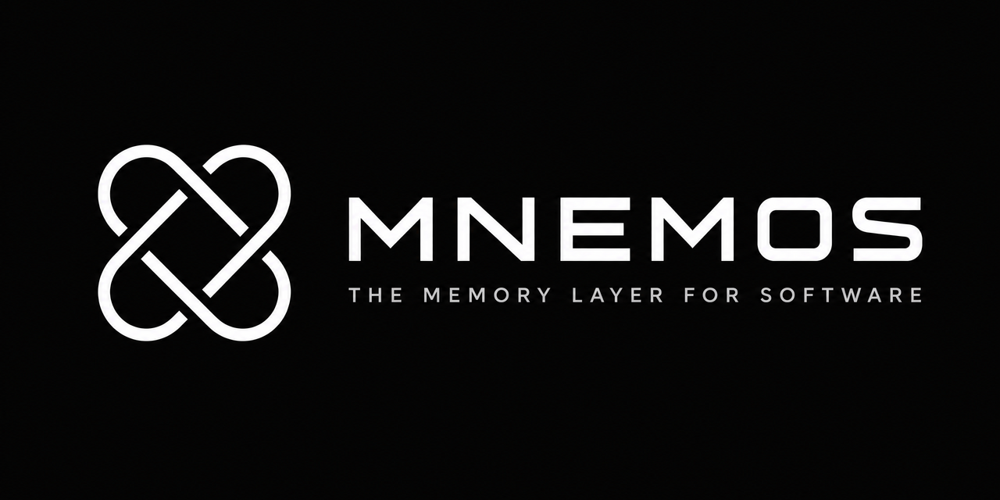

# Mnemos

<p align="center">
  
</p>

> **The memory layer for software.** One command turns any repository into structured intelligence that humans and AI agents understand instantly.

```bash
npx mnemos .
```

Mnemos is a local-first **Software Memory Engine** — it discovers architecture, compresses it into Repository DNA, and answers the questions every new developer asks. No cloud. No API keys. No guesswork.

---

## Visual intelligence

Anything you can do in **Graphify** (dependency graphs) or static architecture diagrams, Mnemos does here — and goes further with DNA, blast-radius queries, and verified benchmark scores.

<p align="center">
  
  &nbsp;
  
</p>

| Output | Use it for |
|--------|------------|
| **`snapshots/*.svg`** | README badges, PR summaries, social posts — animated terminal & results cards |
| **`report/index.html`** | Vibe / Developer / AI Agent report modes |
| **`mnemos ui`** | Interactive graph, heatmap, domains, integrated terminal |
| **`mnemos serve`** | Live `/dna`, `/copilot`, `/impact` for Cursor & Claude |

### How AI should use Mnemos

1. **Read first:** `@.mnemos/project.dna.json` and `@.mnemos/agent_context.json`
2. **Setup once:** `mnemos setup` writes Cursor rules + `AGENTS.md`
3. **Query live:** `mnemos serve` → `GET /copilot?q=what breaks if X changes?`
4. **Share visually:** `mnemos snapshot` → drop SVG cards into docs

---

## Verified benchmark ([Mnemos Bench](./mnemos-bench/README.md))

All numbers measured on real repos. Reproduce anytime:

```bash
npm run build
npm run bench:express
npm run bench:regression
```

### Express (small) — expressjs/express

| Metric | Manual | Mnemos | Gitingest | Graphify |
|--------|--------|--------|-----------|----------|
| **Task accuracy** | — | **80%** | 0% | 0% |
| **Time to Understanding** | 51 min | **2 min** | — | — |
| **Build latency** | — | **0.6s** | 6.3s | 0.9s |
| **AI context tokens** | 177,553 raw | **5,942** | 1,100,000 | 26 |
| **Compression** | 1× | **29.9×** | 0.16× | — |

### NestJS (medium) — nestjs/nest, 1,724 files

| Metric | Mnemos | Gitingest |
|--------|--------|-----------|
| **Task accuracy** | **72.4%** | 0% |
| **Time to Understanding** | **2.6 min** (vs 146 min manual) | — |
| **Build latency** | **35.7s** | 300s |
| **AI context tokens** | **36,424** | 5,200,000 |
| **Compression** | **28.1×** | 0.20× |
| Domains / flows / capabilities | 49 / 37 / 12 | — |

Impact analysis example (NestJS, measured):

> Changing **NestApplication** affects **4** nodes — `nest-application.ts`, `nest-factory.ts`, `testing-module.ts` (+ spec).

Full results: [mnemos-bench/results/VERIFIED.md](./mnemos-bench/results/VERIFIED.md)

---

## AI model evaluation

Test any LLM using Mnemos Bench — give the model only `project.dna.json`, ask the 6 universal tasks, score objectively:

```bash
node mnemos-bench/scorer/ai-eval.mjs express
```

Regression gate for CI:

```bash
npm run bench:regression
```

---

## Killer metrics

**Time To Understanding (TTU)**

| Repository | Without Mnemos | With Mnemos | Savings |
|------------|----------------|-------------|---------|
| Express | 51 min | 2 min | **96%** |
| NestJS | 146 min | 2.6 min | **98%** |

**AI Context Efficiency**

| Repository | Raw tokens | Mnemos DNA+context | Compression |
|------------|------------|-------------------|-------------|
| Express | 177,553 | 5,942 | **29.9×** |
| NestJS | 1,024,722 | 36,424 | **28.1×** |

---

## What Mnemos produces

```
.mnemos/
├── project.dna.json          ← AI agents read this first
├── agent_context.json        ← machine-optimized bundle
├── report/index.html         ← Vibe / Developer / AI Agent modes
├── context/architecture.md
└── snapshots/*.svg           ← terminal-build, benchmark-results, architecture…
```

### Three report modes

| Mode | Audience | Focus |
|------|----------|-------|
| **Vibe** | PMs, founders | Capabilities, user journeys |
| **Developer** | Engineers | Domains, flows, smells, scores |
| **AI Agent** | Claude, Cursor, Codex | DNA, agent artifacts |

---

## CLI

| Command | Description |
|---------|-------------|
| `npx mnemos .` | Full experience — analyze, DNA, report |
| `mnemos ask <question>` | Architecture copilot (graph-aware impact analysis) |
| `mnemos dna [path]` | Repository DNA summary |
| `mnemos explain [path]` | Plain-language description |
| `mnemos build [path]` | Build memory model |
| `mnemos score [path]` | Health + AI readiness |
| `mnemos serve [path]` | Memory server for agents (`:4000`) |
| `mnemos snapshot [path]` | Animated SVG cards (terminal, results, architecture) |
| `mnemos setup [path]` | Install Cursor rules + AGENTS.md for AI |
| `mnemos ui` | Launch interactive **developer cockpit** — repos, architecture, flows, terminal, AI inspector |

---

## Development

```bash
git clone <repo>
cd mnemos
npm install
npm run build
npx mnemos .
```

Monorepo: `@mnemos/core` · `@mnemos/cli` · `@mnemos/ui`

### Dashboard (`mnemos ui`)

The UI is a full **repository intelligence cockpit** — not a static report viewer.

| View | What it shows |
|------|----------------|
| **Platform overview** | All repos, aggregate health, AI readiness, quick actions |
| **Repo workspace** | Overview, architecture, flows, code map, history, AI context |
| **AI Inspector** | Auth summaries, routes, architecture excerpts, start-here tasks |
| **Terminal panel** | Embedded `mnemos` CLI (`build`, `ask`, `flows`, `impact`) |

See [packages/ui/README.md](./packages/ui/README.md) for layout, shortcuts, and agent workflows.

## License

MIT
