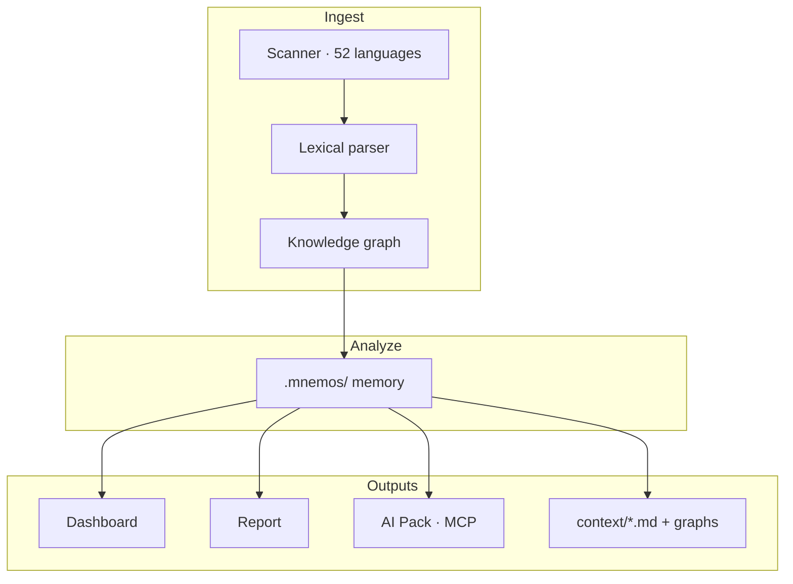

# Get Mnemos

**The memory layer for software.** One command turns a codebase into architecture intelligence that humans and AI can use immediately.

[](LICENSE)
[](package.json)
[](https://www.npmjs.com/package/getmnemos)
[](https://getmnemos.vercel.app)

[Documentation](docs/architecture.md) · [Install](INSTALL.md) · [Graphs](docs/GRAPHS.md) · [Languages](docs/LANGUAGES.md) · [AI Pack v1](docs/ai-pack.md) · [Benchmarks](mnemos-bench/) · [Contributing](docs/contributing.md)

```bash
npx getmnemos .
```

> **Install:** npm package is **`getmnemos`** — not the squatted `mnemos` name. See [INSTALL.md](INSTALL.md).

Local-first. No cloud. No API keys. No guesswork.

---

## Project status

Mnemos is **pre-launch OSS** — we are polishing before growth, not pretending to be finished.

| Surface | Status | Notes |
|---------|--------|-------|
| **CLI** | Stable | `npx getmnemos .`, `audit`, `supernova`, `pack`, `serve`, `mcp`, **`memory`** |
| **HTML report** | Stable | Dashboard-aligned design, offline shareable |
| **AI Pack v1 + MCP** | Stable | Built for Claude Code, Cursor, Codex |
| **Fable Mindset (New Gen)** | Stable | `fable-mindset` skill + discipline rules; `mnemos discipline` measures the gap |
| **Shared Agent Memory** | Stable | `memory build`, `serve`, `stats`, `budget`, `shard` — pre-sharded `.mnemos/*.memory.json` for subagents |
| **Memory Engine v3** | Stable | SQLite + hybrid retrieval, sessions, encrypted sync — `.mnemos/engine/` |
| **Dashboard** | Preview | Cockpits work; layout & panels still refining — [help welcome](CONTRIBUTING.md) |

We dogfood Mnemos on this repo. Creator marketing comes **after** dashboard polish — not before.

**Claude Code first:** `mnemos setup --platform claude` → skill + `CLAUDE.md` context. See [Claude OSS application brief](docs/claude-oss-application.md) if you are evaluating ecosystem impact.

**New Gen — the Fable Mindset:** Mnemos distills the *working discipline* observed across [4,665 public Fable 5 traces](https://huggingface.co/datasets/Glint-Research/Fable-5-traces) into an installable skill, so Opus 4.8, Sonnet — any agent — adopts Fable-grade habits: reason before acting, verify before claiming done, recover with method. It **ports the habits, not the weights** — no model retraining, no capability transplant. Measure your own gap with `mnemos discipline --opus`.

---

## The 30-second pitch

**What:** Mnemos scans your repository, builds a dependency graph, discovers domains, capabilities, and user journeys, then writes structured memory to `.mnemos/`. It produces a dashboard, a shareable HTML report, and **AI Pack v1** — a versioned JSON contract agents can reason from without opening the UI.

**Why:** AI coding tools and new teammates both fail the same way: they grep random files instead of reading architecture. Mnemos gives every consumer the same ground truth — once, locally, on every build.

**Who:** Vibecoders who need the product story. AI orchestrators feeding Claude, Cursor, or Trae. Human developers who want architecture, smells, and copy-ready repair context in one cockpit.

---

## Showcase — four artifacts, one build

Every `npx mnemos .` run produces the same intelligence in four shapes. The legend **Dashboard · Report · AI JSON** appears in every chrome so you always know which one you are looking at.

<table>
  <tr>
    <td width="50%" align="center">
      
      <br /><sub><b>Terminal → Memory</b> · one command writes DNA, agent context, an HTML report, and shareable SVG cards</sub>
    </td>
    <td width="50%" align="center">
      
      <br /><sub><b>Verified results</b> · 100% task accuracy on Express & NestJS — reproducible via mnemos-bench</sub>
    </td>
  </tr>
</table>

These cards are produced by `mnemos snapshot` — drop them straight into a README or PR.

| | Artifact | You get | Best for |
|---|----------|---------|----------|
| 🖥️ | **Terminal** | `npx mnemos .` → `.mnemos/` memory | CI, first scan, refreshing DNA |
| 📊 | **Dashboard** | `mnemos ui` → `/vibe` · `/ai` · `/coder` cockpits | **Preview** — interactive exploration (community-driven) |
| 📄 | **Report** | `report/index.html` · `?mode=vibe\|ai\|coder` | **Stable** — stakeholder demos, async review, shareable HTML |
| 🤖 | **AI JSON** | `mnemos pack` · `/json/:repoId` · `/copilot/pack/:repoId` | Claude, Cursor, Trae — copy or HTTP, no UI required |

```bash
npx mnemos . && npx mnemos ui    # dashboard at localhost:5173
# report: .mnemos/report/index.html or report/index.html
npx mnemos pack --section=summary --pretty
```

---

## Quick start

```bash
# 1. Analyze the repo (writes .mnemos/)
npx mnemos .

# 2. Open the interactive dashboard
npx mnemos ui

# 3. Serve memory for agents (optional)
npx mnemos serve
# → http://localhost:4000/copilot/pack/local

# 4. Export AI Pack v1
npx mnemos pack --section=summary --pretty

# 5. Shared Agent Memory (subagents load shards, not raw source)
npx mnemos memory build .
npx mnemos memory serve    # → localhost:4000/domain/auth
```

**Expected outputs in `.mnemos/`:** `project.dna.json`, `memory.json`, `agent_context.json`, `context/*.md`, `report/index.html`

---

## Outputs at a glance

| Artifact | Command / URL | Audience | Use case |
|----------|---------------|----------|----------|
| **Dashboard** | `mnemos ui` → `localhost:5173` | You + team | **Preview** — interactive exploration (panels & layout in progress) |
| **Report** | `report/index.html` | Stakeholders | **Stable** — async review, demos, shareable HTML (`?mode=vibe\|ai\|coder`) |
| **AI JSON** | `mnemos pack` · `/json/:repoId` · `/copilot/pack/:repoId` | Claude, Cursor, Trae | Copy-paste structured context, repair prompts, score + issues |
| **DNA** | `.mnemos/project.dna.json` | Any agent | Compressed repo DNA — `@`-mention first |
| **MCP** | `mnemos mcp` | IDE agents | 15+ tools + 11 resources via Model Context Protocol |
| **Sync** | `mnemos sync` | CI + local dev | Codegraph-style auto-rebuild on file changes |
| **Wrap** | `mnemos wrap -- <cmd>` | AI agents | RTK-style token-compressed command output |

**Legend:** Every dashboard view and the report header show **Dashboard · Report · AI JSON** so you always know which artifact you are looking at.

---

## The three modes

Modes are **routes**, not toggles. The URL is canonical.

| Mode | Route | For | One-liner |
|------|-------|-----|-----------|
| **Vibe** | `/vibe/:repoId/story` | Vibecoders, PMs, founders | Product story, journeys, capabilities — no raw JSON |
| **AI** | `/ai/:repoId/home` | Claude, Cursor, Trae users | AI Pack v1, repairs, verify — agent-first |
| **Coder** | `/coder/:repoId/overview` | Human developers | Architecture, flows, code map, smells, copilot |

See [docs/modes.md](docs/modes.md) for deep links and keyboard map.

---

## Dashboard tour

| Section | Coder route | What it does |
|---------|-------------|--------------|
| Overview | `/coder/:id/overview` | Health score (explained), issues, quick navigation |
| Architecture | `/coder/:id/architecture` | Systems, domains, graph, smells |
| Flows | `/coder/:id/flows` | Execution paths + user journeys |
| Code Map | `/coder/:id/code` | File map + tech stack |
| History | `/coder/:id/history` | Build history, timeline, risk heatmap |
| AI Context | `/coder/:id/ai` | Copilot, context docs, JSON pack |

---

## AI Pack v1

Single versioned JSON contract built once in `@mnemos/core`, used by UI, CLI, serve, and report.

```bash
npx mnemos pack --section=issues --mode=ai -o .mnemos/ai-pack.json
curl -s localhost:4000/copilot/pack/local?section=score | jq .version
# → "1.0.0"
```

**Claude / Cursor / Trae recipe:**

1. Run `npx mnemos .`
2. Run `npx mnemos setup --platform claude` (Claude Code skill + `CLAUDE.md`)
3. Paste `npx mnemos pack --section=summary --mode=ai` output, **or**
4. Point the agent at `http://localhost:4000/copilot/pack/local`, **or**
5. Open `http://localhost:5173/json/local` and click **Copy AI Pack v1**
6. Use `mnemos wrap -- npm test` to feed token-compressed output back to the agent

Full spec: [docs/ai-pack.md](docs/ai-pack.md)

---

## Verified benchmarks

Headline numbers from [mnemos-bench/results/VERIFIED.md](mnemos-bench/results/VERIFIED.md) — reproducible locally:

| Repo | Accuracy | Build | Tokens | Compression |
|------|----------|-------|--------|-------------|
| Express (small) | **100%** | 500 ms | 8,901 | 19.9× |
| NestJS (medium) | **100%** | 73 s | 212,366 | 4.8× |

```bash
npm run bench:regression   # fixture regression gate
npm run bench:express      # Express fixture
npm run bench:fresh:express  # clean .mnemos + re-score
npm run bench:ai-eval      # AI blind eval
```

Windows PowerShell — clean cache before re-benchmarking:

```powershell
Remove-Item -Recurse -Force mnemos-bench\repos\express\.mnemos -ErrorAction SilentlyContinue
npm run bench:express
```

---

## Architecture



Every build writes **Mermaid diagrams** into `.mnemos/context/` — see [docs/GRAPHS.md](docs/GRAPHS.md) for the full catalog and [docs/LANGUAGES.md](docs/LANGUAGES.md) for the 50-language parsing pipeline.

Details: [docs/architecture.md](docs/architecture.md)

---

## CLI reference

| Command | Description |
|---------|-------------|
| `mnemos .` / `mnemos build` | Analyze repo, write `.mnemos/` |
| `mnemos ui` | Launch dashboard (`localhost:5173`) |
| `mnemos serve` | REST API (`localhost:4000`) |
| `mnemos mcp` | MCP stdio server for IDEs |
| `mnemos pack` | Print AI Pack v1 (`--section`, `--mode`, `-o`) |
| `mnemos report` | Generate `report/index.html` (`--report-path report.html`, `--open`) |
| `mnemos sync` | Auto-rebuild graph on file changes (local index) |
| `mnemos wrap -- <cmd>` | Token-compressed command output for AI agents |
| `mnemos ask "…"` | Architecture copilot |
| `mnemos setup` | Install AGENTS.md, Cursor rules, **Claude Code + Fable discipline skills** |
| `mnemos explain` | Plain-language repo summary |
| `mnemos score` | Health score breakdown |
| `mnemos flows` | List execution flows |
| `mnemos impact` | Blast radius analysis |

```bash
mnemos --help   # full flag list
```

---

## Shared runtime

`MnemosRuntime` in `packages/core` is the single source of truth for REST (`mnemos serve`) and MCP (`mnemos mcp`):

- Parallel load of memory, graph, and BM25 search index
- Typed `AgentEnvelope` responses
- Actionable errors (`NOT_BUILT`, `NOT_FOUND`, `GRAPH_UNAVAILABLE`)
- Protocol parity — same queries via HTTP or MCP

### MCP tools (15)

`query_graph` · `get_dna` · `explain_repo` · `onboard` · `get_node` · `get_neighbors` · `shortest_path` · `impact_analysis` · `list_domains` · `list_flows` · `list_capabilities` · `search` · `get_health` · `review_diff` · `refresh_memory`

---

## Contributing

See [docs/contributing.md](docs/contributing.md). PRs welcome.

## Roadmap

[docs/roadmap.md](docs/roadmap.md)

---

## License · Security · Code of Conduct

- [MIT](LICENSE)
- [Security policy](SECURITY.md)
- [Code of Conduct](CODE_OF_CONDUCT.md)
